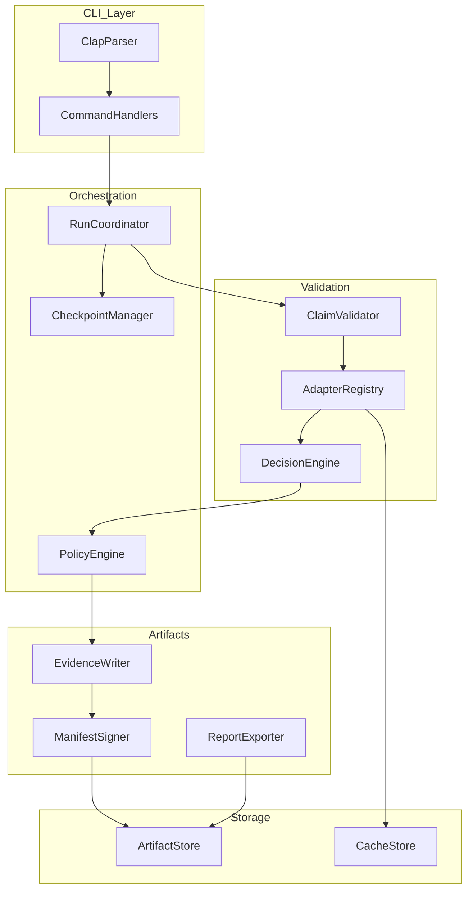
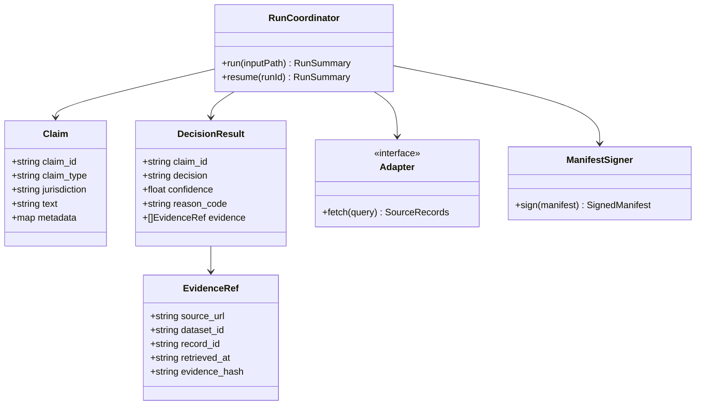

# System Design: evidenced

## Architecture Overview

`evidenced` uses a pipeline-oriented CLI architecture with deterministic processing and artifact output for verification traceability.



## Component Diagram



## File Structure

```
evidenced/
├── Cargo.toml
├── src/
│   ├── main.rs
│   ├── cli.rs
│   ├── config.rs
│   ├── orchestrator/
│   │   ├── mod.rs
│   │   ├── run.rs
│   │   └── checkpoint.rs
│   ├── validation/
│   │   ├── mod.rs
│   │   ├── claim.rs
│   │   ├── decision.rs
│   │   └── policy.rs
│   ├── adapters/
│   │   ├── mod.rs
│   │   ├── texas_open_data.rs
│   │   └── texas_capitol_data.rs
│   ├── artifacts/
│   │   ├── evidence.rs
│   │   ├── manifest.rs
│   │   └── report.rs
│   └── storage/
│       ├── artifact_store.rs
│       └── cache_store.rs
└── tests/
    ├── cli_integration.rs
    ├── policy_tests.rs
    └── adapter_contracts.rs
```

## Technology Stack

- **Language**: Rust (stable)
- **CLI**: `clap`
- **Async HTTP**: `reqwest` + `tokio`
- **Serialization**: `serde`, `serde_json`
- **Logging**: `tracing`
- **Config**: `serde_yaml` + env overrides

## Error Handling

- Strongly typed error categories (`InputError`, `AdapterError`, `DecisionError`, `ArtifactError`)
- Partial-failure tracking for continue-on-error runs
- Structured stderr diagnostics with correlation IDs

## Testing Strategy

- Unit tests for decision/policy logic
- Integration tests for command flows (`run`, `resume`, `report`)
- Contract tests for adapter mappings
- Property tests for deterministic artifact generation
