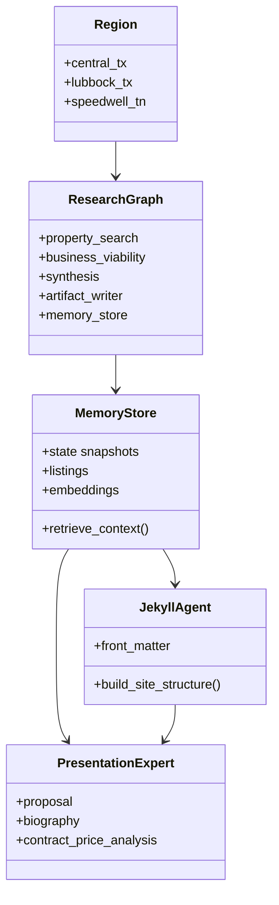

# System Design: research-pipeline

## Architecture Overview

The pipeline compiles a **StateGraph** per selected region. Research agents run linearly; an **artifact_writer** persists files; a **memory_store** node persists **state, long-term memory, embeddings, and retrieval context** to a database. A **downstream publish pipeline** (Jekyll GitHub Pages agent + presentation expert) consumes the DB and artifacts to build a **portfolio site**.

```mermaid
flowchart TB
    subgraph cli [CLI]
        Args[clap Args]
    end

    subgraph graph [StateGraph]
        START([START]) --> PS[property_search AgentNode]
        PS --> BV[business_viability AgentNode]
        BV --> SYN[synthesis AgentNode]
        SYN --> AW[artifact_writer FunctionNode]
        AW --> MS[memory_store FunctionNode]
        MS --> END([END])
    end

    subgraph db [Persistence]
        DB[(SQLite or vector DB)]
    end

    subgraph publish [Publish pipeline]
        JK[jekyll_pages_agent]
        PE[presentation_expert]
        Site[Jekyll site gh-pages]
    end

    Args --> graph
    AW --> FS[(runs/region/date/)]
    MS --> DB
    FS --> JK
    DB --> JK
    DB --> PE
    JK --> PE
    PE --> Site
```

## State Channels (graph)

| Key | Description |
|-----|-------------|
| `region` | Region slug string |
| `run_dir` | Absolute or relative output directory for this run |
| `property_findings` | Text from property search agent |
| `business_analysis` | Text from business viability agent |
| `synthesis_output` | Combined formatting from synthesis agent |
| `artifacts_manifest` | JSON listing files written |
| `run_id` | Optional UUID or timestamp id for DB rows |

After **memory_store**, final state may include `db_run_id` or similar pointer.

## Database / memory node

**Responsibilities:**

1. **State variables**: Serialize relevant graph state per run (region, times, paths, manifest JSON) for audit and resume.
2. **Long-term memory**: Tables for listings (dedupe key = normalized URL or geo + title hash), viability summaries, learnings (e.g. which queries yielded results).
3. **Embeddings**: Chunk property findings, business analysis, and synthesis; embed via chosen API; store vectors + chunk text + `listing_id` / `run_id` foreign keys.
4. **Context**: Materialized or on-demand **top-k retrieval** for each listing for downstream agents.

**Suggested tables (illustrative):**

- `runs(id, region, started_at, run_dir, manifest_json, ...)`
- `listings(id, run_id, external_key, title, json_blob, ...)`
- `embedding_chunks(id, run_id, listing_id, text, vector, model, created_at)`
- `learnings(id, run_id, category, content_json)`

Implement **memory_store** as a `FunctionNode` calling a `db` module (SQLx or rusqlite + chosen vector extension).

## Publish pipeline: Jekyll + presentation expert

**Inputs:** `runs/**` artifacts, SQL/vector queries over `listings` and `embedding_chunks`, run metadata, optional `learnings` / progress notes.

**GitHub Jekyll Pages agent:**

- Emit `_config.yml`, theme-appropriate `_layouts/`, `_sass` or `assets/main.css`, a collection `properties` or dated posts.
- Per-property **front matter**: title, region, price hints, links to source URLs, `listing_id`, paths to generated markdown sections.
- **GitHub Pages** compatibility: document baseurl, branch (`gh-pages` or `docs/` folder on main).

**Presentation expert:**

- LLM agent(s) that read retrieved context + JSON listings + viability and author:
  - **Farm business proposal** (plant-only).
  - **Biography** (narrative).
  - **Sales contract draft + price analysis** (sections, comparables narrative, **disclaimer**).
- Output markdown/html fragments consumed by Jekyll layouts.

**Orchestration:** second binary `research-pipeline-publish` or `cargo run -- publish` that runs retrieval → Jekyll agent → presentation expert → file write → optional `git` commit hook (document only unless git tooling is in scope).

## Component Diagram



## File Structure (extended)

```
research-pipeline/
├── Cargo.toml
├── README.md
├── schemas/
│   ├── property_candidates.schema.json
│   └── business_viability.schema.json
├── migrations/              # SQL migrations for memory DB
├── site-template/           # optional Jekyll starter
└── src/
    ├── main.rs
    ├── lib.rs
    ├── regions.rs
    ├── graph.rs
    ├── artifacts.rs
    ├── db.rs                # memory_store, embeddings, queries
    └── publish/             # jekyll + presentation modules
        ├── mod.rs
        ├── jekyll.rs
        └── presentation.rs
```

## JSON Artifacts (unchanged)

- **property_candidates.json**, **business_viability.json**, **summary.md**, **manifest.json**, **synthesis_raw.txt** (fallback).

## Error Handling

- Missing API key: print usage and exit with clear message.
- Graph errors: propagate with `anyhow` context.
- Artifact writer: never panic on parse failure; degrade to raw file.
- DB errors: transactional where possible; log failed embedding batches without losing run row.

## Testing Strategy

- Unit tests: fence parsing, slugging, DB schema migration smoke test.
- Integration test (optional): in-memory SQLite + single fake embedding vector.
- `cargo clippy` and `cargo test` in CI.
