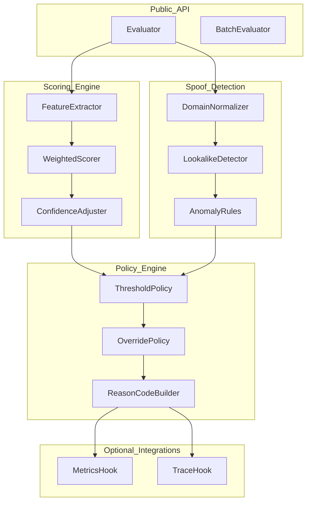

# System Design: trustscore

## Architecture Overview

`trustscore` is structured as a pure Go core with optional integration adapters for metrics and caching.



## Core Interfaces

```go
type Evaluator interface {
    Score(ctx context.Context, req ScoreRequest) (ScoreResult, error)
    Decide(ctx context.Context, req DecisionRequest) (DecisionResult, error)
    BatchDecide(ctx context.Context, reqs []DecisionRequest) ([]DecisionResult, error)
}
```

## File Structure

```
trustscore/
├── go.mod
├── trustscore.go
├── score/
│   ├── request.go
│   ├── result.go
│   └── weighted.go
├── spoof/
│   ├── normalize.go
│   ├── lookalike.go
│   └── anomaly.go
├── policy/
│   ├── decision.go
│   ├── thresholds.go
│   └── reason_codes.go
├── internal/
│   ├── config/
│   └── validate/
└── tests/
    ├── score_test.go
    ├── spoof_test.go
    ├── policy_test.go
    └── benchmark_test.go
```

## Technology Stack

- Go 1.21+
- Standard library-first core
- Optional metrics integrations via adapter interfaces

## Testing Strategy

- Table-driven tests for score and decision logic
- Fuzz tests for URL/domain normalization
- Race tests for concurrent batch evaluation
- Benchmarks for scoring and decision throughput

