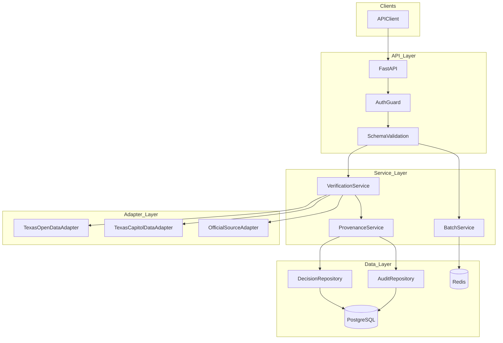
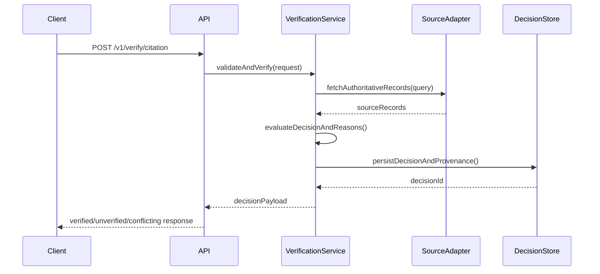

# System Design: verdict-api

## Architecture Overview

`verdict-api` uses a layered service design: request validation, decision orchestration, source adapter retrieval, and provenance persistence.



## File Structure

```
verdict-api/
├── app/
│   ├── main.py
│   ├── config.py
│   ├── api/
│   │   ├── routes_verify.py
│   │   ├── routes_batch.py
│   │   └── routes_history.py
│   ├── schemas/
│   │   ├── request_models.py
│   │   ├── decision_models.py
│   │   └── provenance_models.py
│   ├── services/
│   │   ├── verification_service.py
│   │   ├── batch_service.py
│   │   └── provenance_service.py
│   ├── adapters/
│   │   ├── texas_open_data.py
│   │   ├── texas_capitol_data.py
│   │   └── official_sources.py
│   ├── persistence/
│   │   ├── models.py
│   │   ├── repositories.py
│   │   └── db.py
│   └── security/
│       ├── api_keys.py
│       └── scopes.py
└── tests/
    ├── test_verify.py
    ├── test_batch.py
    ├── test_auth.py
    └── test_adapters.py
```

## Technology Stack

- FastAPI + Pydantic v2
- SQLAlchemy + PostgreSQL
- Redis for batch coordination and caching
- `httpx` for authoritative source requests
- OpenTelemetry instrumentation

## API Endpoints

- `POST /v1/verify/citation`
- `POST /v1/verify/official`
- `POST /v1/verify/election`
- `POST /v1/verify/document`
- `POST /v1/verify/batch`
- `GET /v1/history/decisions`
- `GET /v1/history/decisions/{decision_id}`

## Decision Flow



## Error Handling

- RFC 7807 problem detail payloads
- Clear reason codes for adapter timeouts, schema mismatch, and evidence conflicts
- Correlation IDs in every response header

## Testing Strategy

- Unit tests for decision evaluation and reason code mapping
- Integration tests for verification endpoints and persistence
- Contract tests for adapter payload normalization
- Security tests for API key and scope enforcement
